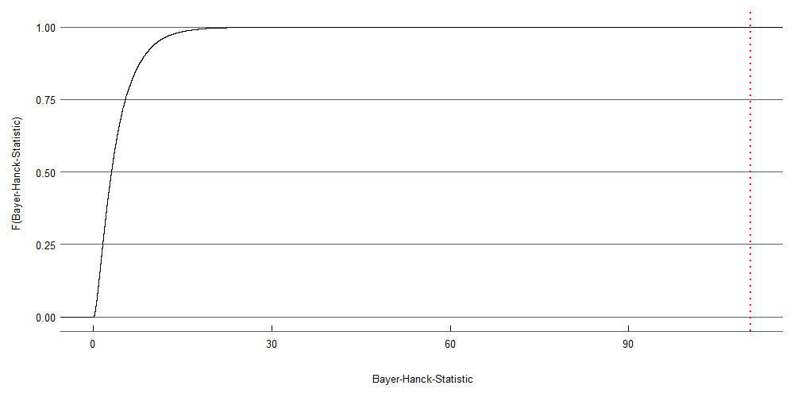

<!-- % Template Version 1.2 -->

```{r setup, include=FALSE}
knitr::opts_chunk$set(echo = TRUE)
```

# Introduction
An issue of substantial interest in time series analysis is, whether there exists any meaningful equilibrium relationship between two or more time series variables. Various hypothesis tests have been suggested for testing this so-called cointegration relationship, with the null hypothesis of no cointegration. Their local power, however, relies mostly on a specific nuisance parameter, namely the squared long-run correlations of error terms driving the variables. This may lead to inconclusive results, as one test may reject the null hypothesis, while others accept. The detection of cointegration relationships among time series variables is therefore complicated. Furthermore, the decision for an applicable test poses a challenge for the practitioner. 

An approach for resolving this issue might be a combination of the different tests. Bayer and Hanck suggest a method for providing meta tests, with high power for all forms of the nuisance parameter [@Bayerhanck2009]. Their approach is based on Fisher's Chi-squared test [@Fisher1925]. It can be shown, that this provides an unambiguous test decision. 

So far, there exists a Stata module for computing the above-mentioned non-cointegration test. However, there is no implementation in R yet. Therefore, the objective of this work was the development of the R package **bayerhanck**, to implement the eponymous test. In section 2, the theoretical background of the combined non-cointegration test will be explained further. Next, the structure of the associated R package and its functions will be explained in Section 3. In Section 4, the functions will be illustrated with a real data set. Finally, everything will be recapped in a conclusion.


# Theory of Non-Cointegration Tests
As mentioned above, @Bayerhanck2009 point out, that there is no uniformly most powerful test for cointegration. This is due to the fact, that all common tests are affected by the nuisance parameter $R^2$, where $R^2$ is defined as the squared correlation of $\pmb{\nu}_{1t}$ with $\nu_{2t}$.^[$R^2:= \omega_{12}^{'} \pmb{\Omega}_{11}^{-1}\omega_{12} / \omega_{22}$] Furthermore, @pesavento2004 has shown that for varying $R^2$ different tests are more powerful. Hence it is not clear which test should be applied to the time series data. 

To resolve these issues, Bayer and Hanck propose a combination of various cointegration tests. To derive the properties of the underlying tests and their combination, Bayer and Hanck use the following model by @pesavento2004:

\begin{align}
\label{eq:regressor}
\triangle \pmb{x}_t = \pmb{\tau}_1 &+  \pmb{\nu}_{1t}\\
\label{eq:y}
y_t  = \left(\mu_2 - \pmb{\theta}' \pmb{\mu}_1 \right) &+ \left(\tau_2 - \pmb{\theta}' \pmb{\tau}_1 \right)t + \pmb{\theta}' x_t + u_t \nonumber
\end{align}

where $u_t = \rho u_{t-1} + v_{2t}$.

Equation \eqref{eq:regressor} describes the regressors, whereas equation \eqref{eq:y} describes the possible cointgeration vector. The observed sample can be denoted as $\pmb{z}_0, \ldots , \pmb{z}_T$, where $\pmb{z}_t = (\pmb{x}_t^{'}, y_t)$. 

Under the following two assumptions and $\rho = 1$ the $\mathcal{H}_0$ hypothesis holds for the vector $\pmb{z}_t$: 

\begin{itemize}
  \item[] Assumption 1: 
  \begin{itemize}
    \item[] $\{ \pmb{\nu}_t \}$ satisfied a Functional CLT, i.e. $\displaystyle T^{-1/2} \sum_{t = 1}^{[\cdot T]} \pmb{\nu}_t \Rightarrow \pmb{\Omega}^{1/2} \pmb{W}(\cdot)$, i.e $\pmb{z}_t$ is $I(1)$  
  \end{itemize}
  \item[] Assumption 2:
  \begin{itemize}
    \item[] There are no cointegrated relationships among the variables in $\pmb{x}_t$
  \end{itemize}
\end{itemize}

Two essential properties of this model are: firstly, the local power of the underlying tests only depends on the parameters $c := T(\rho -1)$ and $R^2$. Secondly, even asymptotically these statistics are only weakly correlated under $\mathcal{H}_0$. [@gregory_mixed_2004] 

With these central findings it may be possible to achieve a more robust test by combining individual underlying tests. Bayer and Hanck utilise the cointegration tests of Engel and Granger [@Englegranger1987], Johansen [@Johansen1988], Boswijk [@Boswijk1994] and Banerjee [@Banerjee1998] as their underlying tests.

Each of these tests has a slightly different approach to testing for a possible cointegration relationship. The Engle-Granger Test tests the null of non cointegration against the alternative hypothesis of at least one cointegration relationship. For this, a simple two-step procedure is used. Firstly, the residuals $\hat{u}_t$ of a regression of the dependent variable on the independent variable is computed. Then, the first differences of these residuals are regressed on the lagged residuals. The test statistic for the Engle-Granger Test is then the $t$-statistic $t^{ADF}_\gamma$ on $\gamma$ in the aforesaid second regression $\triangle \hat{u}_t = \gamma \hat{u}_{t-1} + \sum_{p = 1}^{P-1}\nu_p \triangle \hat{u}_{t-p} +\epsilon_t$. [@Englegranger1987]

As opposed to the Engle-Granger Test, @Johansen1988's cointegration test is able to test for $h$ multiple cointegration relationships. The null hypothesis is $h = 0$. To implement this test, a vector error correction model (VECM)

\begin{align}
\triangle {\bf z}_t = {\bf \Pi z}_{t-1} + \sum^{P-1}_{p=1}\pmb{\Gamma}_p \triangle{\bf z}_{t-p} + {\bf d}_t + \pmb{\epsilon}_t
\end{align}

needs to be estimated first. Bayer and Hanck employ the test statistic $\lambda_{\max} (h) = - T \ ln(1 - \hat{\pi}_1)$, where $\hat{\pi}_1$ denotes the largest solution of $|\pi \pmb{S}_{11} - \pmb{S}_{10} \pmb{S}_{00}^{-1} \pmb{S}_{01}|= 0$.^[$\pmb{S}_{ij}$ denotes the moment matrices of reduced rank regression residuals.]

The cointegration tests of @Boswijk1994 and @Banerjee1998 are based on error correction model tests. Boswijk's test statistic $\hat{F}$ is the Wald statistic for $\mathcal{H}_0: (\varphi_0, \pmb{\phi}_1^{'}) = 0$, whereas Banerjee _et al._'s test statistic is the $t_{\gamma}^{ECR}$ ratio for $\mathcal{H}_0 : \varphi_0 = 0$ of the error correction model. To derive the error correction model, the usual least squares estimate is used: $\triangle y_t = d_t + \pi_{0x}^{'} \triangle \pmb{x}_t + \varphi_0 y_{t-1} + \pmb{\varphi}_{1}^{'} \pmb{x}_{t-1} + \sum_{P = 1}^{P} \left( \pmb{\pi}_{px}^{'} \triangle  \pmb{x}_{t-p} + \pi_{py} \triangle y_{t - p} \right) + \epsilon_t$. 

From now on, $t_i$ denotes the test statistic of the underlying test $i$. If the this test rejects for large (small) values, take $\xi_i := t_i (-\xi_i = t_i)$. To combine these tests into a more powerful joint non cointegration test, Bayer and Hanck use an aggregator employed by @Fisher1925's Chi-squared test. The test statistic $\tilde{\chi}_{\mathcal{I}}^2$ is than defined as:

\begin{align}
  \label{eq:bayer-hanck}
  \tilde{\chi}_{\mathcal{I}}^{2} := -2 \sum_{i \in \mathcal{I}} \ln(p_i),
\end{align}

where $\mathcal{I}$ is the index set of the $\xi_i$.

The test statistic has the property, that the distribution under the $\mathcal{H}_0$ hypothesis converges to a random variable $\mathcal{F}_{\mathcal{I}}$ $\left(\tilde{\chi}_{\mathcal{I}}^{2} \rightarrow_{d} \mathcal{F}_{\mathcal{I}} \right)$. This guarantees, that the statistic has a well-defined asymptotic null distribution. According to @Bayerhanck2009, this null distribution is nuisance parameter free and only depends on the amount of tests combined. Consequently, the joint $\mathcal{H_0}$ hypotheses can be simulated. 

Under the alternative hypotheses $\mathcal{H}_1$ the test statistic probability converges to $\tilde{\chi}_{\mathcal{I}}^{2} \rightarrow_P  \infty$, which means that the test statistic is consistent if at least one of the underlying tests is consistent.


# Implementation of the Package **bayerhanck** in R
The package consists of four functions for the underlying tests, as well as the function for the combined test. Furthermore, the cumulative distribution function of the null hypothesis can be plotted.

## Creating the package

The package **bayerhanck** was created using `create_package()` from **devtools** [@hester_devtools_2020]. This generates an R project, files for the package metadata, such as `DESCRIPTION`, `NAMESPACE` and `LICENSE`, and a sub directory for the R code of subsequent functions. The individual functions were documented with the help of **roxygen2** [@wickham_roxygen2_2020]. The roxygen comments in the source file were then converted to `.Rd` files in the sub directory `man/`. 

## Implementation of the underlying Tests
The underlying tests can be carried out by their eponymous commands, namely `englegranger()`, `johansen()`, `banerjee()` and `boswijk()`. The former two partly rely on already implemented functions from the packages **urca** [@pfaff_urca_2020] and **tsDyn** [@stigler_tsdyn_2020]. Due to the absence of associated functions for the latter two, those had to be programmed manually. All functions take several arguments, from which only `formula` and `data` need to be filled out by the practitioner. Further arguments orientate themselves on the default values defined in the Stata implementation of the Bayer-Hanck Test. For the argument `lags`, which determines the number of lags to be included in the model, the default value is therefore set to 1. The argument `trend` describes the deterministic components of the model. The practitioner may choose from `none`, for no deterministics, `const`, for a (unrestricted) constant and `trend`, for a (unrestricted) constant plus (unrestricted) trend. The default value is set to `const`. Aside from the Johansen Test, all functions where programmed in such a way, that `trend = "none"` simply removes the intercept from all performed linear regressions in the functions. For `trend = "trend"` the intercept was maintained and a trend component was added with `seq_along()`. This generates a sequence, which usually takes the length of the dependent variable $y$. For `trend = "const"` the intercept was maintained and thus no changes were made to the linear regression formula. The trend selection for the Johansen Test will be explained later on. 

The functions of the underlying tests all return an object of classes `co.test` and `list`. The console also returns the value of the test statistic, as well as the name of the executed test. 

In accordance with the previously explained structure, the function `englegranger()` takes the form:

```{r eval = FALSE}
englegranger(formula, data, lags = 1, trend = "const")
```

The structure of this function is orientated towards the implementation of the Engle-Granger test in the aforesaid Stata module. Therefore, none of the various existing functions in R is used. Firstly, a linear regression is performed, according to the formula entered in `englegranger()`. Next, an augmented Dickey-Fuller test is applied to the residuals from this regression. For this, the function `ur.df()` from the **urca** package is used. The output value of the test statistic is then used as the test statistic of the Engle-Granger test.

The function for the Johansen test contains the additional argument `type`, which specifies if an maximum eigenvalue or a trace test should be conducted. Therefore, the options are either `trace` or `eigen`, with `eigen` being the default choice. The structure of the function takes the form:

```{r eval = FALSE}
johansen(formula, data, type = "eigen", lags = 1, trend = "const")
```

First of all, if the practitioner chooses `trend = "trend"`, it has to be renamed to `"both"`. This describes the required name for the following functions to correctly specify the requested deterministic component. Then, the function estimates a VECM by Johansen (MLE) method with `VECM` from the package **tsDyn**^[Compared to `ca.jo` from the **urca** package, the functions from **tsDyn** allow for the specification of an unrestricted constant and trend, which where used in the Stata Package for the Bayer-Hanck Test.]. A test of the cointegrating rank is conducted. For this, the function `rank.test()` from the same package is used. Here, the maximum eigenvalue for $h = 0$ is used as the output test statistic of `johansen()`.

The construction of the functions for the Banerjee and Boswijk test was almost identical. Therefore, both functions will be illustrated in a single step. The arguments for both functions are identical to those from `englegranger()`:

```{r eval = FALSE}
banerjee(formula, data, lags = 1, trend = "const")
boswijk(formula, data, lags = 1, trend = "const")

```

For the construction of these functions, first differences had to be taken of the dependent, as well as the independent variables. Furthermore, a matrix of the lagged values of all variables in first differences was constructed. Then, the procedure for the Banerjee and Boswijk test were implemented as outlined above. For calculating the test statistics, the coefficients, as well as the covariance-matrix were extracted from the last linear regression model. For the Banerjee test, the coefficient of the first regressor has to be divided by the associated variance from the covariance-matrix. Here, one has to consider, that the position of said values changes, when `trend = "none"`, as the intercept is removed^[Due to the different order in the Stata output, this could have been ignored there, but poses a threat in R.]. 

For the test statistic of the Boswijk test, the vector of coefficients will firstly be matrix multiplied with the inverse covariance-matrix. Next, this product will then again be matrix multiplied with the vector of coefficients. 

## Implementation of the function `bayerhanck()`

@Bayerhanck2009's combined non-cointegration test can be carried out by the command `bayerhanck()`. It accepts all of the arguments of the previously explained underlying tests. Furthermore, it also contains the additional arguments `test`and `crit`, which can be passed to the function call. The function thus takes the form:

```{r eval = FALSE}
bayerhanck(formula, data, lags = 1, trend = "const", 
           test = "all", crit = 0.05)
```

The argument `test` determines which combination of the underlying tests should be executed. Here, the practitioner can choose between the default `all` (performs all of the aforementioned tests) or `eg-j`, which only carries out the Engle-Granger and Johansen test.

The argument `crit` sets the significance level of the test. The practitioner may choose between 0.01, 0.05 and 0.1, with the default 0.05.

After inserting the formula and the data, the selected underlying tests are called. The test statistics of each selected test are obtained and stored in a vector. Then, the p-values are calculated by using the corresponding empirical null distribution. This distribution depends on the number of variables, the trend specification and the combination of the underlying tests. Next, the p-values are logarithmised and summed. In accordance with equation \eqref{eq:bayer-hanck}, they are multiplied with -2 to obtain the test statistic. In the last step, the critical value is selected from the empirical null distribution, subject to the specified significance level.

## Implementation of the function `bayerhanck_1()` 

The obtained values from the previously presented function `bayerhanck()` use the critical values provided by the technical appendix from @Bayerhanck2009. As an extension to this function, the function `bayerhanck_1()` has been developed. It contains additional null distributions, calculated with a Monte Carlo simulation. 

The simulation considers different combinations of the number of variables $K\in\{2,...,12\}$, nuisance parameter $R^2\in\{0,0.05,...,0.95\}$, and cases of determinstic trends in the variables, with (i) = no deterministics, (ii)  = constant, and (iii) = constant and trend means. Since only the null distribution is of any interest, the parameter $c$ will be hold constant to zero. The simulation is run with 25,000 repetitions with a vector length of $T = 1000$. 


```{r, include = FALSE, warning = FALSE, error=FALSE}

load('bayerhanck_cv.Rda')
load('crit_values.Rda')
library(dplyr)
library(kableExtra)

row_names <- seq(1:11)
dt_0.05 <- round(Null_Distr_B_ECR_J_E[,,25000*0.95],4)
cv_b_h <- round(crit_val_2_0.05,4)

space <- rep('',nrow(dt_0.05))
diff_sim <- round(dt_0.05 - cv_b_h,4)

overview <- cbind(row_names, space, dt_0.05, space,cv_b_h, space, diff_sim) 
```

The first step in the loop, to generate the data basis for the simulation, is to draw random shocks $u$ from a normal distribution. Next, the Wiener process is simulated, which is calculated as a cumulative sum by the root of the length of the vector$(T)$. Furthermore, the Ohrnstein Uhlenbeck Process has to be modelled.

Afterwards, the Vienna and Ohrstein Uhlenbeck Process is corrected according to the type of trend. If a constant trend is present, the mean value is subtracted and if both a constant and a trend are present, both are subtracted. Finally, the common components are calculated. 

Then the test statistics of each test are calculated and stored in a vector, which is then sorted. Because we have simulated under the assumptions of $\mathcal{H}_0$ we have now simulated the asymptotic zero distribution.^[For futher details see @pesavento2004]


Table \ref{tab:com} shows the 5% critical values of the simulation in the first block. The values of Bayer and Hanck are in the second, while their difference is shown in the third block. Overall, the simulated values do not deviate too far from those by Bayer and Hanck. 
It can therefore be assumed, that the simulation delivers reliable results.

```{r, echo = FALSE, warning = FALSE, error=FALSE}


knitr::kable(overview, digits = 4, caption = '\\label{tab:com} Comparison of the simulated values with the critical values obtained by Bayer and Hanck \n', 
              col.names = c("K-1",'',"(i) ","(ii)","(iii)", '',"(i) ","(ii)","(iii)", '', "(i) ","(ii)","(iii)" ), align = 'c',   booktabs = TRUE, linesep = "")%>%
  kable_styling(latex_options = c("striped", "hold_position"), font_size = 8)%>%
  add_header_above(c(" ",'', "Simulation" = 3,'', "Bayer & Hanck" = 3,'', "Difference" = 3))
                
  

```  

With this simulation, the function `bayerhanck_1` can be implemented. Analogous to the basic version, it takes the form:

```{r eval = FALSE}
bayerhanck_1(formula, data, lags = 1, trend = "const", 
           test = "all", crit = 0.05)
```

Due to the availability of the simulated distributions under the $\mathcal{H}_0$, the function is now capable of calculating and printing p-values. In its current implementation, the function stayed with the initial options for the argument `test`, `eg-j` and `all`. At this point in time, the amount of data is already large and further increases with each additional test combination by about 7 Megabyte. This is due to the fact, that for each combination of regressors and trend types, a simulated $\mathcal{H}_0$ distribution with 25,000 values is needed. In the current state, the package with the function `bayerhanck_1` has a size of about 16 Megabyte with only two test options. However, in order to reduce the amount of data and allow for further test combinations, the simulated distribution might be reduced to 10,000 values per combination of regressors and trend types, once the package is further developed.

## Implementation of the methods `summary.co.test` and `summary.bh.test`

For a better representation of the calculated test statistics, this package defines methods for the generic function `summary`. For displaying this, one has to call:

```{r eval = FALSE}
summary(object, ...)
```

It requires an object of classes `co.test` or `bh.test`, generated by the aforesaid functions. `summary` then prints the formula, the number of lags and the trend specification, entered in the function calls. Furthermore, the matrix with the test statistics, as well as the calculated p-values for the underlying tests is displayed. In a final step, the Bayer-Hanck statistic and its corresponding critical value are shown.

## Implementation of the method `plot.bh.test`

Furthermore, a method for the generic function `plot` has been written. It is available for objects of the class `bh.test` and plots the simulated cumulative distribution function under $\mathcal{H}_0$ with a `ggplot`. 

```{r eval = FALSE}
plot(x, theme = "dark", ...)
```

The practitioner may use the argument `theme` to choose between `theme = "light"` for a light theme, and `theme = "dark"` for a dark theme. The latter was designed in such a way, that it matches the associated theme of the Shiny app. The dark theme is set to default. However, the practitioner is free to choose any other theme for `ggplot`, by simply adding it with the + operator.

Here, the execution of `plot` accesses the test statistic of the `bayerhanck` function, the number of regressors and the trend type. It can therefore deduce, which null distribution is to be plotted. This information is then passed to the function `ggplot` from the package **ggplot2** [@wickham_ggplot2_2020]. `ggplot::stat_ecdf()` is then used to plot the null distribution. In addition, the value of the Bayer-Hanck statistic is marked with a dotted x-intercept line.

# Illustration

The package shall be illustrated on the data set `ibmskpo` from the package **MTS** [@tsay_mts_2020]. It contains monthly simple returns of the stocks of International Business Machines *ibm*, Coca Cola *ko*, and the S&P composite index *sp*. We will test for a cointegration relationship between the variables *sp*, *ko*, and *ibm*. The sample period is from January 1961 till Decembet 2011 and the data can be load into the global entironment with the command `data("mts-examples", package = "MTS")`.To keep a certain clarity we will show the test only in the variant `eg-j`. The procedure can be applied in the same with the option `all`, to include all four underlying tests. 

The functions for the underlying tests will be demonstrated with a Engle-Granger test and the Johansen test:

```{r eval=FALSE}
eg_test <- englegranger(sp ~ ibm + ko, data = ibmspko)

jo_test <- johansen(sp ~ ibm + ko, data = ibmspko)
```

Next, we will have a look at the summary of the tests:

```{r eval = FALSE}
summary(eg_test)

----------------------------------------------------------
Engle-Granger Test
----------------------------------------------------------
Formula: sp ~ ibm + ko
Lags: 1
Trend: const
 
Value of test statistic: -17.6686
```

and

```{r eval=FALSE}
summary(jo_test)

----------------------------------------------------------
Johansen Test
----------------------------------------------------------
Formula: sp ~ ibm + ko
Lags: 1
Trend: const
 
Value of test statistic: 279.5175
```

Next, we will calculate the Bayer-Hanck Test, both with the values from @Bayerhanck2009's technical appendix and the Simulation. First, the results for the basic version are shown:

```{r eval = FALSE}
# test = "eg-j"
bh_eg_j <- bayerhanck(sp ~ ibm  + ko, data = ibmspko,
                      test = "eg-j")

```

The summary for the basic version of `bayerhanck()` shows:

```{r eval = FALSE}
# test = "eg-j"
summary(bh_eg_j)

----------------------------------------------------------
Bayerhanck Test for Non-Cointegration
----------------------------------------------------------
Formula: sp ~ ibm + ko
Lags: 1
Trend: const
 
Underlying Tests:
                Engle-Granger Johansen
Test Statistics      -17.6686 279.5175
p-Values               0.0000   0.0000
 
Value of the Fisher Type Test statistic: 110.5241
5% Critical value for the Test statistic: 10.895
```

Next, we will calculate the Bayer-Hanck test with specifically simulated values:

```{r eval = FALSE}
# test = "eg-j"
bh_eg_j_1 <- bayerhanck_1(sp ~ ibm + ko, data = ibmspko,
                      test = "eg-j")

```

The summary then shows:

```{r eval = FALSE}
# test = "eg-j"
summary(bh_eg_j_1)

----------------------------------------------------------
Bayerhanck Test for Non-Cointegration
----------------------------------------------------------
Formula: sp ~ ibm + ko
Lags: 1
Trend: const
 
Underlying Tests:
                Engle-Granger Johansen
Test Statistics      -17.6686 279.5175
p-Values               0.0000   0.0000
 
Value of the Fisher Type Test statistic: 110.5241
5% Critical value for the Test statistic: 10.8454 
P-value of the Fisher Type Test statistic: 0
```

The test statistics of the individual tests, but also of the combined tests, are relatively clear. Basically all tests reject the $\mathcal{H}_0$, that there is no cointegration. But as @Bayerhanck2009 have shown, there are several examples from the literature where the evidence is not so clear. A further interpretation of the results shall not be made here.


To demonstrate the implemented method for the generic function `plot()`, we will additionally plot the object from `bayerhanck_1` for `test = "all"`. For a harmonious appearance in this documentation, we will set `theme = "light"`.

```{r eval = FALSE}
plot(bh_all_1, theme = "light")
```

 

# Conclusion

The implementation of the R package **bayerhanck** has been documented. It contains functions for two different versions of the Bayer-Hanck Test for non cointegration, as well as functions for the underlying cointegration tests. The former has been implemented in a functional way, so that the functions `bayerhanck()` and `bayerhanck_1()` call the underlying test functions. Since the underlying tests can be executed autonomously, the scope of application is increased. The sub-functions certainly require more effort so the tests can be applied to more versatile problems. This applies above all to the tests of Banerjee and Boswijk, as we found no well working implementation in R. 

In the current version we also developed a further implementation with the `bayerhanck_1()` function. This function additionally calculates the p-value of the test statistics based on the empirical distribution stored in the function. For the aforementioned data set with two regressors and approximately 26,000 observations, the function needs about one second computation time. Further speed up of the calculation might be desired, if one wants to work with bigger data. One consideration might be to write the code directly in `C`, instead of `R`, to save a step in the translation process.

Furthermore, two methods for the generic functions `summary()` and `plot()` were defined Another implementation, which was not covered in this documentation, is a user friendly application within a shiny app. If it is published on a server, potential users might use the functions of this package without using `R`themselves.

Of course, this package will be an object to further development. A plausible advancement could be to increase the number of possible tests and allow other combinations, than already implemented. For this, the simulated distributions of the null distribution would have to be stored. The power of each combination would have to be checked first. However, this might lead to the problem, that users may tend to try out different combinations, until they get their desired result.

\newpage


